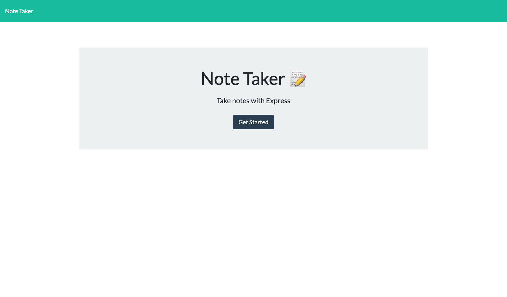

# Note-taker
https://github.com/conneriraola/note-taker

# Description
Note Taker is an app that allows you to record notes that contain a title and text.

# Screenshot

# License
MIT
(https://opensource.org/licenses/MIT)

# Questions
* Github Username: conneriraola
* Github profile: https://github.com/conneriraola
* conner_iraola@yahoo.com